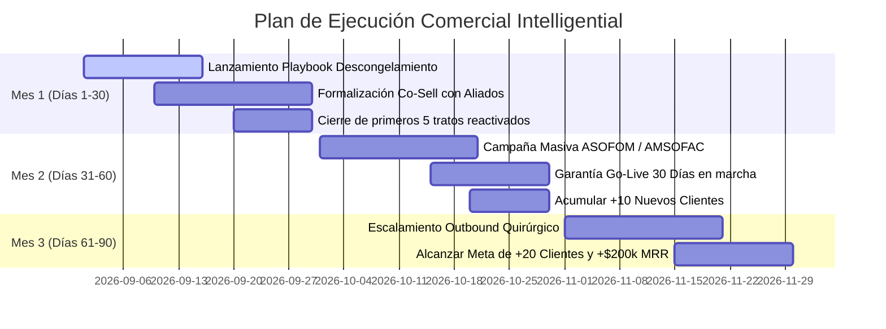

# 🏦 Caso de Negocio y Plan Estratégico de Crecimiento — Intelligential

**Preparado para:** Sesión Estratégica de Revisión del 27 de Julio  
**Líder de Proyecto:** Antonio Gutiérrez (RevOps & Business Strategy)  
**Socio Clave / Founder:** Luis Fernando (CEO & Co-founder de Fintech Bar)  
**Objetivo Q3-Q4:** +20 Clientes Nuevos | +$200,000 MXN MRR Adicional | Go-to-Market Acelerado

---

## 1. 📌 Resumen Ejecutivo y Tesis de Inversión

**Intelligential** es la plataforma de infraestructura core bancaria y BaaS *Smart Native®* diseñada específicamente para **SOFOMes (40%)** y **Arrendadoras Financieras (30%)** en México.

En un mercado saturado de soluciones legadas lentas o módulos dispersos, Intelligential resuelve la fragmentación tecnológica consolidando los **4 Pilares del Crédito en un solo lugar**:
1. **Core Financiero** (administración de cartera y reportes de originación).
2. **Solicitud Digital** (onboarding sin papel y flujos de aprobación).
3. **Onboarding & KYC** (validación de identidad INE, SAT integradas).
4. **Cumplimiento PLD/FT** (regulación embebida para SOFOM desde el día 1).

### Métricas Clave de Negocio (Unit Economics Target)
* **Ticket Promedio de Renta (MRR Base):** $50,000 MXN / mes *(ajustable según tamaño de cartera/proyecto)*.
* **Fee de Activación & Setup:** **Exactamente 2x la Renta Mensual del proyecto** *(Ejemplo: $100,000 MXN de Setup Fee para un proyecto de $50,000 MXN/mes)*.
* **LTV Promedio (36 meses):** $1,900,000 MXN por cliente (incluyendo MRR + Setup + adiciones).
* **CAC Objetivo:** $45,000 MXN (Relación LTV/CAC > 40x).
* **Ciclo Promedio de Venta:** 3 meses (reductible a 30 días con el *Plan Smarty* y la *Garantía Go-Live*).

---

## 2. 📊 Análisis del Portafolio Actual de Clientes (Win-Analysis)

### ¿Quiénes son los clientes actuales?
El portafolio actual de Intelligential está compuesto por SOFOMes ENR de cartera mediana ($20M - $150M MXN) y Arrendadoras regionales que migraron de hojas de cálculo, desarrollos in-house obsoletos o proveedores legacy como DynamiCore.

### ¿Por qué han comprado a Intelligential? (Drivers Principales de Conversión)
1. **Solución "All-in-One" Sin Terceros ni Sorpresas:**
   - La competencia cobra licencias separadas por módulo de PLD, conectores de Buró y portales web. Intelligential entrega todo empaquetado (*Plan Smarty*), evitando costos ocultos.
2. **Despliegue Rápido ("Activable en semanas, no en meses"):**
   - El proceso de activación en 3 pasos (Firma el Día 1 → Sandbox/Capacitación Semanas 1-4 → Producción en el Día 30) reduce el riesgo operativo de la SOFOM.
3. **Tranquilidad Regulatoria CNBV / PLD:**
   - Cumplimiento de Prevención de Lavado de Dinero (PLD/FT) y listas negras embebido nativamente desde el primer día, sin integrar parches externos.
4. **Ecosistema Nivel Enterprise Pre-Integrado:**
   - Conexión nativa con aliados clave (Mifiel, Weetrust, Círculo de Crédito, Buró de Crédito, Nubarium, Prevenciondelavado.com, STP, Monato, Syntage, Nufi, Moffin). El cliente no invierte meses ni dinero en desarrollo de APIs.

### ⚡ Matriz de Dolores del Mercado (¿Por qué SÍ compran vs. ¿Por qué NO compran?)

| Dimensión | 🟢 ¿Por qué SÍ compran? (Win Drivers) | 🔴 ¿Por qué NO compran? (Frenos / Friction) | ⚔️ Cómo lo Descongelamos en Intelligential |
| :--- | :--- | :--- | :--- |
| **Tiempo de Salida** | Go-Live garantizado en **30 Días** vs. 6-12 meses de competidores. | Miedo a la parálisis operativa durante la migración de cartera. | Garantía SLA contractual con bonificación sobre Setup Fee si nos retrasamos. |
| **Costos / Presupuesto** | Paquete Todo-en-Uno sin cobros sorpresa por usuario o módulo extra. | Contrato vigente y pendiente de vencer con proveedor actual (ej. DynamiCore). | Oferta **"Migración Sin Doble Costo"**: bonificación de renta mientras vence el contrato anterior. |
| **Regulación CNBV/PLD** | Módulo PLD/FT nativo e inspeccionable desde el primer día. | Miedo a reprobar auditoría o perder historial regulatorio en el cambio. | Migración de datos estructurada e historial embebido listo para inspección. |
| **Ecosistema & APIs** | Conexión lista con STP, Mifiel, Buró, Nubarium, Nufi sin código custom. | Experiencias negativas pasadas con parches de software que nunca funcionaron. | Demo en vivo en Sandbox mostrando llamadas API nativas funcionales. |
| **Adopción del Equipo** | Interfaz moderna, limpia e intuitiva (Zero training lag). | Resistencia al cambio del personal de mesa de control acostumbrado a Excel. | Capacitación incluida en Semanas 1-4 y acompañamiento continuo post-salida. |

---

## 3. 💡 Impacto de Negocio en la Originación y Matching por Industria

### ⚙️ El Flujo Real de Originación: ¿Qué hace Intelligential en la práctica?
En el día a día operativo, Intelligential sustituye el caos de plataformas desconectadas ejecutando un **flujo de originación punta a punta en una sola pantalla**:

```
[1. SOLICITUD DIGITAL] ➔ [2. VALIDACIÓN KYC/SAT] ➔ [3. CUMPLIMIENTO PLD] ➔ [4. FIRMA ELECTRÓNICA] ➔ [5. CARTERA DE COBRANZA]
  (Onboarding Web)         (INE / Buró / CIEC)       (69-B / OFAC / PEPs)       (NOM-151 Mifiel)         (Riel SPEI / STP)
```

**Impacto Financiero en la Originación:**
* **Tiempo de Respuesta:** Reduce el ciclo de aprobación de **14 días laborables a 24 horas**.
* **Costo por Expediente:** Disminuye el costo de originación por crédito en un **65%** al eliminar la captura manual de mesa de control.
* **Tasa de Abandono del Cliente:** Cae del **35% al 4%** al evitar solicitudes en papel.

---

### 🧩 Matching Operativo: Los 4 Pilares del Crédito vs. Dolores del Proceso

| Pilar del Producto | ¿Qué Ejecuta en la Originación? | ¿Por qué hace MATCH y resuelve el problema? |
| :--- | :--- | :--- |
| **Pilar 01: Core Financiero** | Administra productos, tablas de amortización, devengamiento de intereses y cobranza. | **Elimina la cartera descuadrada en Excel** y la doble digitación manual. Conecta la originación directa al saldo deudor. |
| **Pilar 02: Solicitud Digital** | Captura datos de prospectos, expedientes y flujos de aprobación sin papel. | **Acelera la velocidad de venta**. La mesa de control aprueba en 1 clic sin traspasar papeles físicamente. |
| **Pilar 03: Onboarding & KYC** | Valida INE en tiempo real, consulta Buró/Círculo y extrae constancias del SAT. | **Elimina el fraude por suplantación de identidad** y automatiza el scoring crediticio sin cambiar de ventana. |
| **Pilar 04: Cumplimiento PLD/FT** | Contrasta al acreditado contra listas negras (OFAC, 69-B SAT, PEPs) de forma nativa. | **Evita multas de la CNBV** y ahorra $120,000 MXN/año al no requerir un software de PLD externo. |

---

### 🎯 Match Perfecto con las 3 Principales Industrias Target (ICP)

```
+---------------------------------------------------------------------------------------------------+
|                           MATCH CON LAS 3 INDUSTRIAS CORE DE INTELLIGENTIAL                       |
+-----------------------------------+-----------------------------------+---------------------------+
| 🏢 1. SOFOMes (40% del Target)    | 🚜 2. ARRENDADORAS (30% Target)   | ⚡ 3. LENDERS DIGITALES   |
| "Tengo 4 contratos y sistemas     | "Seguimos conciliando en Excel.   | "Nuestro core in-house no |
|  que no se hablan entre sí."      |  El onboarding es en papel."      |  escala y da deuda técnica|
+-----------------------------------+-----------------------------------+---------------------------+
```

#### 🏢 1. SOFOMes (40% de la Meta)
* **Dolor de la Industria:** Suelen operar con un sistema para originación, un software externo para PLD, Excel para cobranza y otro proveedor para firma electrónica. La cartera vive descuadrada y cada auditoría de la CNBV es una pesadilla de 3 semanas.
* **Match con Intelligential:** **Unificación Total.** Intelligential empaqueta los 4 pilares en un solo contrato y una sola base de datos. La originación pasa automáticamente a cobranza sin riesgo de descalce.

#### 🚜 2. Arrendadoras Financieras / Pura (30% de la Meta)
* **Dolor de la Industria:** Tienen flujos complejos de activos (vehículos, maquinaria, equipo médico), tablas de depreciación, rentas vencidas y contratos extensos que hoy firman físicamente en papel.
* **Match con Intelligential:** **Automatización de Leasing & Pagarés NOM-151.** Permite estructurar contratos de arrendamiento puro y financiero con tablas de rentas automatizadas, vinculadas a la firma electrónica de Mifiel/Weetrust con validez legal ejecutiva.

#### ⚡ 3. Lenders Digitales / Fintechs (30% de la Meta)
* **Dolor de la Industria:** Empezaron construyendo un core "hecho en casa" (*in-house*), pero al crecer la cartera el sistema improvisado no soporta nuevos productos financieros y requiere ingenieros de software muy caros para mantenimiento.
* **Match con Intelligential:** **API-First & Escalabilidad Smart Native®.** Permite conectar sus interfaces mediante API REST sin reconstruir el backend, eliminando la deuda técnica y garantizando escalabilidad a más de 100,000 créditos sin contratar programadores extra.

---

### 🤝 Mapa de NUEVAS Incorporaciones de Partners Estratégicos (Roadmap Q3-Q4)
*(Nuevas alianzas inéditas para expandir el valor comercial del Core)*

| Categoría de Expansión | NUEVO Partner Objetivo | Propuesta de Valor Inédita para SOFOMes | Impacto Comercial |
| :--- | :--- | :--- | :--- |
| **Gremios e Instituciones** | **ASOFOM & AMSOFAC** | Convenio institucional como Core homologado con descuento preferencial en Setup Fee para sus 200+ agremiados. | Canal masivo de distribución |
| **Emisión de Tarjetas** | **Pomelo / Credix** | Permite a las SOFOMes emitir sus propias tarjetas de crédito/débito (Mastercard/Visa) conectadas al Core. | Nuevo vertical de ingresos SaaS |
| **Open Banking / Score** | **Belvo / Fintoc** | Extracción automatizada de transacciones bancarias en tiempo real sin requerir PDFs de estados de cuenta. | Underwriting en 60 segundos |
| **Cobranza Inteligente** | **Toku** | Orquestación automatizada de recobro con reintentos inteligentes por WhatsApp y débito directo a tarjeta. | +25% de recuperación de cartera |
| **IA Credit Engine** | **Provenir / Scienaptic** | Motor de decisión crediticia con Inteligencia Artificial para originación automatizada en tiempo real. | Oferta para SOFOMes Enterprise |
| **Cross-Border & Remesas** | **Bitso / Felix Pago** | Recepción de remesas desde EE. UU. como garantía o abono a capital para SOFOMes fronterizas. | Nicho de altísima demanda |

---

## 4. 🚀 5 Iniciativas Estratégicas del Director Comercial

### 1. Programa Co-Selling con Aliados del Ecosistema
Establecer acuerdos formales de referencia cruzada con socios de integración (Mifiel, STP, Nubarium, Nufi). Cada venta conjunta genera beneficios cruzados y comisiones por leads referidos.

### 2. Alianza Institucional con ASOFOM y AMSOFAC
Posicionar a Intelligential como el Core oficial recomendado en los gremios nacionales de SOFOMes y Arrendadoras en México, ofreciendo un beneficio preferencial en el Setup Fee para sus agremiados.

### 3. Garantía SLA "Go-Live en 30 Días"
Eliminar el principal freno de compra ofreciendo contractualmente la puesta en marcha productiva en 30 días. Si Intelligential se retrasa, se otorga una bonificación directa sobre el Setup Fee.

### 4. Oferta "Migración Sin Doble Costo" para Descongelar Pipeline
Para tratos atorados que aún tienen contrato vigente con competidores como DynamiCore: bonificar la renta mensual de Intelligential durante los meses restantes de su contrato anterior, cobrando únicamente el Setup Fee para iniciar la migración ya.

### 5. Esquema de Precios Dinámico (Setup Fee = 2x Renta)
* **Regla Comercial:** `Setup Fee = 2 * Renta Mensual Acordada`.
* Permite flexibilizar el ticket para SOFOMes emergentes ($35k renta → $70k setup) y capturar mayor valor en proyectos Enterprise ($75k renta → $150k setup).

### 6. Auditoría e Infraestructura de Entregabilidad de Correo (Eliminar la Fuga a SPAM)
* **Hallazgo RevOps:** Si los correos o invitaciones de reunión de los fundadores/comerciales caen en la carpeta de SPAM, la tasa de apertura cae del 45% al 12%, destruyendo la conversión del funnel sin importar lo bueno que sea el script.

#### 📊 Impacto Comparativo de Entregabilidad:
| Métrica | Sin Problemas de SPAM (Bandeja Entrada) | Con Correos en SPAM (Situación Actual) | Impacto Real |
| :--- | :--- | :--- | :--- |
| **Tasa de Apertura (Open Rate)** | **45%** | **12%** | 🔻 **73% menos lecturas** |
| **Tasa de Respuesta (Reply Rate)** | **8%** | **1.5%** | 🔻 **80% menos respuestas** |
| **Reuniones Agendadas / 100 envíos** | **4 a 5 reuniones** | **0 a 1 reunión** | 🔻 **5x más esfuerzo requerido** |

* **Acción Técnica Inmediata:** 
  1. Configuración y firmas digitales estrictas: **SPF, DKIM y DMARC** en el dominio principal (`intelligential.tech`).
  2. Adquisición de dominio satélite disponible: **`getintelligential.com`** o **`intelligential.co`** (~$9.77 USD/año en Cloudflare Registrar) para calentar correos outbound (*Email Warmup*) sin arriesgar el dominio raíz.
  3. Verificación de reputación de IP y limpieza de frases disparadoras de filtros SPAM en plantillas.

---

## 5. 🗓️ Plan de Acción 30 - 60 - 90 Días



---

## 6. 🎯 Matriz MEDDIC para Cualificación de Tratos

| Criterio MEDDIC | Aplicación en Intelligential |
| :--- | :--- |
| **Metrics (Métrica)** | ROI cuantificable: Reducción del tiempo de originación (de 5 días a 15 min) y ahorro de 40% en licencias separadas. |
| **Economic Buyer (Comprador Económico)** | CEO, Director General o Socio Fundador de la SOFOM / Arrendadora. |
| **Decision Criteria (Criterio de Decisión)** | Facilidad de cumplimiento PLD/CNBV, Go-Live en 30 días y costo total transparente. |
| **Decision Process (Proceso de Decisión)** | Demo de sandbox → Validación de reportes CNBV → Firma de contrato y pago de Setup Fee. |
| **Identify Pain (Puntos de Dolor)** | Sistemas fragmentados, retraso de meses en implementación con DynamiCore, riesgo de multas CNBV. |
| **Champion (Promotor Interno)** | Director de Operaciones, Oficial de Cumplimiento (PLD) o CTO de la entidad financiera. |

---
*Documento preparado por la Célula de Agentes de Ingeniería y Estrategia Comercial para Intelligential.*
