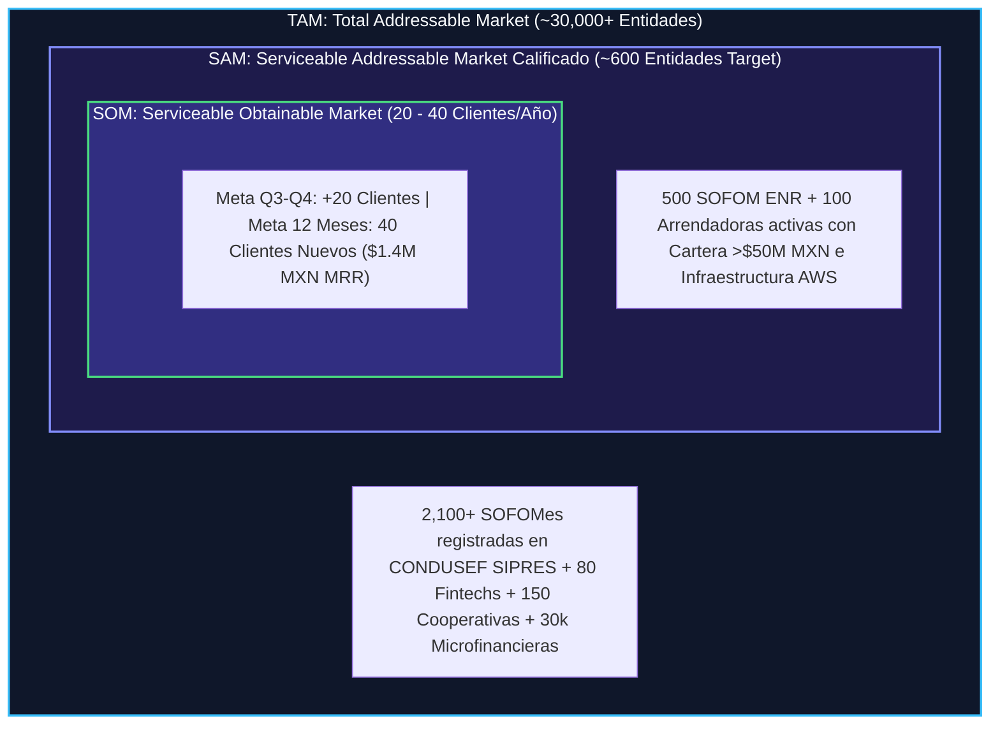

# 🏦 Caso de Negocio y Plan Estratégico de Crecimiento — Intelligential

**Preparado para:** Sesión Estratégica de Alineación con Luis Fernando Sánchez (CEO & Co-founder)  
**Líder de Proyecto / Full-Cycle AE & RevOps:** Antonio Gutiérrez  
**Objetivo Q3-Q4:** +20 Clientes Nuevos (+ $200,000 MXN MRR Adicional)  
**Meta SOM (12 Meses):** 40 Clientes Nuevos (Ritmo Anualizado)  
**Mercado Objetivo Calificado (SAM):** 1,113 Entidades en México (500 SOFOM ENR, 100 Arrendadoras, 100 Lenders Digitales, 200 Fintechs)  

> [!IMPORTANT]
> **Marco Metodológico de Prudencia RevOps (Hipótesis & Auditoría Inicial):**  
> Toda propuesta de optimización de pricing, modelado de saturación de pipeline y sugerencias de expansión se presentan estrictamente como **hipótesis estratégicas y sugerencias a revisar a mediano plazo** durante la sesión de descubrimiento del Lunes.
> 
> Reconociendo la **adquisición de Intelligential por parte del fondo de inversión 5X Capital en Diciembre de 2024**, la ejecución táctica definitiva dependerá de auditar en vivo con Luis (quien conoce la industria a fondo):
> 1. **Salud de Caja & Mandato del Fondo:** Runway actual, metas de rentabilidad EBITDA vs. agresividad de gasto en adquisición (CAC).
> 2. **Historial Real de Tracción (Últimos 12-18 Meses):** Ritmo histórico de cierre, tasa de churn y Net Retention Rate (NRR) real.
> 3. **Mezcla de Canales de Adquisición:** Desglose del pipeline actual generado por eventos presenciales (ASOFOM/AMSOFAC), campañas de marketing inbound, referencias del portafolio de 5X Capital o prospección outbound en frío.

---

## 1. 📌 Resumen Ejecutivo y Tesis de Inversión

**Intelligential** es la única plataforma de infraestructura core bancaria y BaaS *Smart Native®* mexicana que integra nativamente **Core Bancario + Cumplimiento Normativo (CNBV/PLD) + Onboarding Digital (INE, SAT, IMSS)** en un solo sistema sobre AWS, activable en semanas y a un precio accesible para instituciones no bancarias.

### 💰 Unit Economics y Matriz de Tiers (ACV Real de Intelligential)
* **ACV Promedio Estimado:** **$438,000 MXN / año (~$36,500 MXN / mes)**.
* **Tier 1 - Startup Monoproducto:** $20,000 MXN / mes ($240,000 MXN / año).
* **Tier 2 - Mid-Market:** $42,000 MXN / mes ($504,000 MXN / año).
* **Tier 3 - Multi-Producto:** $83,000 MXN / mes ($998,000 MXN / año).
* **Tier 4 - Enterprise:** $200,000 MXN / mes ($2,400,000 MXN / año).
* **Fee de Activación & Setup Vigente:** 2x la Renta Mensual *(Sugerencia de optimización a revisar a mediano plazo abajo)*.
* **LTV Promedio (36 meses):** $1,400,000 - $3,000,000 MXN por cliente.

---

## 2. 🔬 Ajuste Metodológico de Nicho: B2B Enterprise (Intelligential) vs. B2B Masivo (Clip)

Es crítico distinguir la diferencia estructural de ambos modelos de negocio para evitar cometer el error de trasladar tácticas de volumen masivo a un mercado finito:

| Dimensión Estratégica | Modelo Clip (Agregador / B2B Masivo) | Modelo Intelligential (Infrastructure SaaS / Nicho B2B) |
| :--- | :--- | :--- |
| **Tamaño del Mercado (TAM/SAM)** | Masivo (Millones de PyMEs y comercios) | **Finito de Nicho (~600 Cuentas Objetivo en México)** |
| **Ticket Promedio (ACV)** | Transaccional (Bajo por usuario) | **Alto ($438,000 MXN / año promedio)** |
| **Ciclo de Venta** | Corto / Transaccional (Días) | **Consultivo (1 a 3 meses / Decisiones de Consejo)** |
| **Tolerancia al Error Outbound** | Alta (Perder un lead no impacta el mercado) | **CERO (Un correo genérico quema el 10% del mercado)** |
| **Estrategia Comercial** | Campañas Inbound / Volumen Masivo | **Prospección Quirúrgica (Sniper Sales) / ABM** |

---

## 3. 💼 Muestra de Deals Calificados (Tiers 1, 2 y 3)

A continuación se detalla una muestra representativa de 15 tratos modelados sobre empresas reales del registro oficial de CONDUSEF, clasificadas por su Tier de precios y propuesta de ROI:

| ID | Denominación Social Real (CONDUSEF) | Estado / Sede | Tier de Pricing | Renta MRR | Setup Fee (2x Renta) | Competidor Actual | ROI Propuesto & Ángulo de Venta |
| :--- | :--- | :--- | :--- | :--- | :--- | :--- | :--- |
| **01** | `Ac-Fin, S.A.P.I. de C.V., SOFOM, E.N.R.` | Querétaro | **Tier 1 (Startup)** | $20,000 MXN | $40,000 MXN | Softcrédito | Ahorro de 35% al incluir onboarding e INE nativo sin pagar licencias extra. |
| **02** | `3A Decker, S.A. de C.V., SOFOM, E.N.R.` | Querétaro | **Tier 1 (Startup)** | $20,000 MXN | $40,000 MXN | Excel + Software | Automatización de cartera. Elimina el riesgo de descalce contable en 30 días. |
| **03** | `ABV Innovación Financiera, S.A.P.I.` | Chihuahua | **Tier 1 (Startup)** | $20,000 MXN | $40,000 MXN | Excel + Contabilidad | Digitalización de originación: reduce el tiempo de aprobación de 10 días a 24h. |
| **04** | `ALG Servicios Financieros México, S.A.` | Veracruz | **Tier 1 (Startup)** | $20,000 MXN | $40,000 MXN | DynamiCore | Sustitución de core lento. Migración sin doble costo mientras vence su contrato. |
| **05** | `APX SF, S.A. DE C.V., SOFOM, E.N.R.` | San Luis Potosí | **Tier 1 (Startup)** | $20,000 MXN | $40,000 MXN | Softcrédito | Módulo PLD nativo embebido; ahorra $120k MXN/año en sistemas externos de PLD. |
| **06** | `AB7 Servicios, S.A. de C.V., SOFOM` | Monterrey, NL | **Tier 2 (Mid-Market)** | $42,000 MXN | $84,000 MXN | DynamiCore | Go-Live en 3 semanas. Elimina cobros ocultos por conectores de Buró de Crédito. |
| **07** | `3JH Servicios Financieros, S.A. de C.V.` | León, GTO | **Tier 2 (Mid-Market)** | $42,000 MXN | $84,000 MXN | Ascendes | Integración nativa con STP y Mifiel para firma de pagarés NOM-151 en 1 clic. |
| **08** | `ADE 2024, S.A.P.I. de C.V., SOFOM` | Tijuana, BCN | **Tier 2 (Mid-Market)** | $42,000 MXN | $84,000 MXN | Mambu (Sin PLD) | Core 3-en-1 cloud sobre AWS sin requerir desarrolladores in-house ni dólares. |
| **09** | `AM Partners, S.A. de C.V., SOFOM` | Culiacán, SIN | **Tier 2 (Mid-Market)** | $42,000 MXN | $84,000 MXN | Legado In-House | Eliminación de deuda técnica en cartera de $165M MXN. Escalabilidad Smart Native®. |
| **10** | `AQ Patrimonial, S.A.P.I. de C.V.` | CDMX | **Tier 2 (Mid-Market)** | $42,000 MXN | $84,000 MXN | Ascendes | Portal de Solicitud Digital 100% marca blanca para clientes de arrendamiento. |
| **11** | `AT One, S.A. de C.V., SOFOM, E.N.R.` | León, GTO | **Tier 2 (Mid-Market)** | $42,000 MXN | $84,000 MXN | Mambu (Sin PLD) | Integración directa de biometría INE/SAT sin contratar intermediarios como Nufi. |
| **12** | `1900 Soluciones Financieras, S.A.` | Monterrey, NL | **Tier 3 (Multi-Prod)** | $83,000 MXN | $166,000 MXN | Excel + Contable | Soporte multi-producto (Arrendamiento + Crédito Simple) en una sola base de datos. |
| **13** | `A55 Financiera, S.A.P.I. de C.V.` | Mérida, YUC | **Tier 3 (Multi-Prod)** | $83,000 MXN | $166,000 MXN | DynamiCore | Garantía SLA Go-Live 30 días para migración de 3 líneas de producto activas. |
| **14** | `ADN Capital Soluciones de Crédito` | Estado de México | **Tier 3 (Multi-Prod)** | $83,000 MXN | $166,000 MXN | Softcrédito | Automatización de cobranza y devengamiento contable automático CNBV/Banxico. |
| **15** | `AMD Handa Capital, S.A. de C.V.` | Hermosillo, SON | **Tier 3 (Multi-Prod)** | $83,000 MXN | $166,000 MXN | Excel + Contable | Orquestación de firma electrónica y pagarés digitales con Mifiel/Weetrust. |

---

## 4. 📈 Cruce TAM / SAM / SOM y Capas de Mercado



---

## 5. 📊 Benchmark del Setup Fee (2x Renta): Estándares de la Industria Core SaaS

| Categoría de Core SaaS | Setup Fee Promedio de la Industria | Rationale y Fricción Comercial |
| :--- | :--- | :--- |
| **Global Enterprise Core** *(Mambu, Thought Machine)* | **50% - 100% del ACV** *(5x a 12x Renta Mensual / $50k-$150k USD)* | Consultoría de migración prolongada (6-12 meses). Alta fricción en Comité de Compras. |
| **Regional Mid-Market Core** *(DynamiCore, Ascendes, Intelligential)* | **1x a 2x Renta Mensual** *($40k - $84k MXN)* | Estándar regional. Recupera costo de onboarding pero frena cierres en tratos de $83k+/mes. |
| **Startup / Modular SaaS** *(Softcrédito, Moffin, Expediente Azul)* | **0.5x Renta o Fee Fijo** *($15k - $30k MXN)* | Entradas baratas. Fomenta el churn alto si el cliente no tiene compromiso operativo. |

---

## 6. 🤖 Recomendación de Tech Stack Comercial: Conversational AI & Call Intelligence (`Samu.ai`)

Para auditar y transparentar el 100% de las conversaciones comerciales del equipo de ventas sin cargar costos inflados, Antonio propone la adopción de **Samu.ai**, plataforma de inteligencia conversacional con precios sumamente accesibles:

```
+-----------------------------------------------------------------------------------------+
|                       MATRIZ DE PRICING ACCESIBLE DE SAMU.AI (REVOPS STACK)             |
+------------------------------------+----------------------------------------------------+
| PLAN GROWTH ($150 USD/mes)         | PLAN PRO ($250 USD/mes - RECOMENDADO)               |
| - Incluye 3 Usuarios               | - Incluye 5 Usuarios                               |
| - Grabación Ilimitada de Llamadas  | - Integración Avanzada con CRM                      |
| - Integración WhatsApp & Video     | - Samu Score (Puntaje de Reunión por IA)           |
| - Notas y compromisos directos al CRM| - Extractor de Objeciones y Menciones de Competencia|
+------------------------------------+----------------------------------------------------+
```

### ⚡ Beneficios Directos para Luis y el Consejo de Intelligential:
1. **Visibilidad 100% de Llamadas ($150-$250 USD/mes):** Permite a Luis y al equipo directivo auditar qué se habla en cada demo de originación y core bancario.
2. **Detección Automática de Objeciones:** La IA extrae menciones de competidores (*"DynamiCore es muy caro"*, *"Mambu no tiene PLD"*) y dudas regulatorias de la CNBV.
3. **Puntuación Automática de Demos (Samu Score):** Evalúa si el vendedor aplicó la metodología MEDDIC y calificó al Comprador Económico correctamente.

---

## 7. 🎙️ Cuestionario de Auditoría & Descubrimiento para la Sesión del Lunes con Luis

1. **Mezcla de Canales Actuales (Eventos vs Campañas vs Referencias 5X Capital).**
2. **Cualificación de Leads Inbound vs Outbound (Evitar quema de tiempo en leads no aptos).**
3. **Mandato del Fondo 5X Capital (Crecimiento MRR vs Margin EBITDA).**
4. **Benchmark & Flexibilidad de Setup Fee.**
5. **Adopción de Samu.ai para Inteligencia Conversacional en Demos ($150 USD/mes).**
6. **Visión de Expansión (Verticales SOFIPOs/SOCAPs y LatAm).**

---
*Documento estratégico preparado para la alineación comercial con Luis Fernando Sánchez.*
