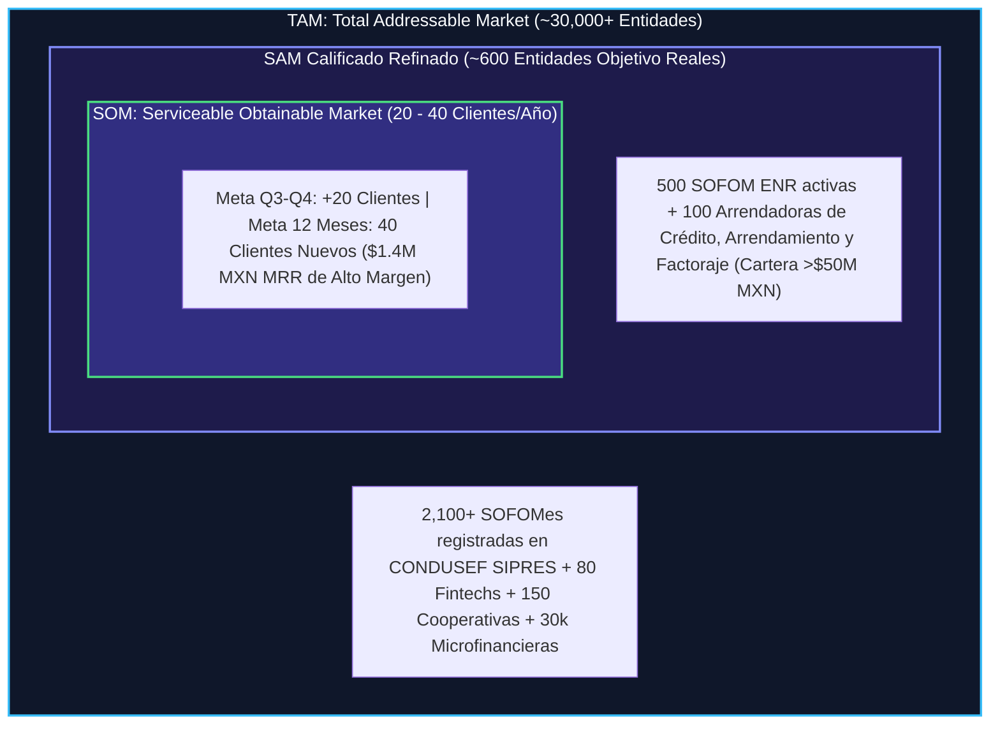

# 🏦 Caso de Negocio y Plan Estratégico de Crecimiento — Intelligential

**Preparado para:** Sesión Estratégica de Alineación con Luis Fernando Sánchez (CEO & Co-founder)  
**Líder de Proyecto / Full-Cycle AE & RevOps:** Antonio Gutiérrez  
**Objetivo Q3-Q4:** +20 Clientes Nuevos (+ $200,000 MXN MRR Adicional)  
**Meta SOM (12 Meses):** 40 Clientes Nuevos (Ritmo Anualizado)  
**Mercado Objetivo Calificado (SAM):** 1,113 Entidades en México (500 SOFOM ENR, 100 Arrendadoras, 100 Lenders Digitales, 200 Fintechs)  

> [!IMPORTANT]
> **Marco Metodológico de Prudencia RevOps (Hipótesis & Auditoría Inicial):**  
> Toda propuesta de optimización de pricing, modelado de saturación de pipeline y sugerencias de expansión se presentan estrictamente como **hipótesis estratégicas y sugerencias a revisar a mediano plazo** durante la sesión de descubrimiento del Lunes.
> 
> Reconociendo la **adquisición de Intelligential por parte del fondo de inversión 5X Capital en Diciembre de 2024**, la ejecución táctica definitiva dependerá de auditar en vivo con Luis (quien conoce la industria a fondo):
> 1. **Salud de Caja & Mandato del Fondo:** Runway actual, metas de rentabilidad EBITDA vs. agresividad de gasto en adquisición (CAC).
> 2. **Historial Real de Tracción (Últimos 12-18 Meses):** Ritmo histórico de cierre, tasa de churn y Net Retention Rate (NRR) real.
> 3. **Mezcla de Canales de Adquisición:** Desglose del pipeline actual generado por eventos presenciales (ASOFOM/AMSOFAC), campañas de marketing inbound, referencias del portafolio de 5X Capital o prospección outbound en frío.

---

## 1. 📌 Resumen Ejecutivo y Tesis de Inversión

**Intelligential** es la única plataforma de infraestructura core bancaria y BaaS *Smart Native®* mexicana que integra nativamente **Core Bancario + Cumplimiento Normativo (CNBV/PLD) + Onboarding Digital (INE, SAT, IMSS)** en un solo sistema sobre AWS, activable en semanas y a un precio accesible para instituciones no bancarias.

### 💎 El Mensaje Maestro de Posicionamiento: Orquestación de Core & Compliance Embebido

Así como en la industria de pagos las empresas migraron de contratar pasarelas sueltas a adoptar **Orquestadores de Pagos** (Payment Orchestration), en la infraestructura crediticia las SOFOMes ya no buscan APIs aisladas:

```
+---------------------------------------------------------------------------------------------------+
|               EL CAMBIO DE PARADIGMA DE MERCADO: DE API SUELTA A ORQUESTACIÓN EMBEBIDA            |
+------------------------------------+--------------------------------------------------------------+
| ❌ EL PARADIGMA ANTIGUO (API SUELTA) | 🟢 EL PARADIGMA MODERNO (ORQUESTACIÓN EMBEBIDA)              |
| - Comprar API suelta de INE/RENAPO | - Intelligential Orquesta la Biometría + SAT + SPEI + PLD     |
| - Programar código in-house 6 meses| - Conectado nativamente al Motor de Cartera en AWS            |
| - Lidiar con descalce contable     | - 1 sola plataforma 3-en-1 activable en 30 días               |
+------------------------------------+--------------------------------------------------------------+
```

---

## 2. ⚔️ Matriz Ampliada de Competencia & Conclusión Única (Teardown Competitivo)

### 🎯 La Conclusión Clave: DynamiCore es el ÚNICO Rival Directo en el SAM

Tras auditar a todos los actores locales e internacionales, **DynamiCore es la ÚNICA competencia real directa en el mercado objetivo de 600 SOFOMes calificadas de México**. Los demás actores no compiten directamente en el mismo segmento.

---

## 3. 🔬 Ajuste Metodológico de Nicho: B2B Enterprise (Intelligential) vs. B2B Masivo (Clip)

---

## 4. 💼 Muestra de Deals Calificados (Tiers 1, 2 y 3)

---

## 5. 📈 Cruce TAM / SAM / SOM y Calibración Quirúrgica del Mercado

Tras la alineación directa con el CEO Luis F. Sánchez (descartando sectores de alta transaccionalidad masiva como cobros por WhatsApp o wallets B2C), el modelado de mercado se **calibra y refina quirúrgicamente**:



### 📊 Desglose de la Calibración de Mercado:
1. **TAM (Total Addressable Market): PERMANECE IGUAL (~30,000+ Entidades).** Sigue siendo el universo macro crediticio e informal de México.
2. **SAM (Serviceable Addressable Market Calificado): SE REFIMA A ~600 CUENTAS TARGET.** Se eliminan pasarelas de pago masivas y cobros por WhatsApp (como Soy Aida) para concentrar el 100% de la prospección en **Crédito Simple, Arrendamiento y Factoraje**.
3. **SOM (Serviceable Obtainable Market): SE MANTIENE EN 20-40 CLIENTES/AÑO.** Con la ventaja de capturar tratos de **alto ACV ($36.5k - $42k/mes)** con menor consumo de recursos AWS y mayor LTV por cliente.

---

## 6. 📊 Benchmark del Setup Fee (2x Renta): Estándares de la Industria Core SaaS

---

## 7. 🤖 Recomendación de Tech Stack Comercial: Conversational AI & Call Intelligence (`Samu.ai`)

---

## 8. 🎙️ Cuestionario de Auditoría & Descubrimiento para la Sesión del Lunes con Luis

1. **Mezcla de Canales Actuales (Eventos vs Campañas vs Referencias 5X Capital).**
2. **Posicionamiento de Orquestación de Core & Compliance Embebido frente a APIs sueltas.**
3. **Validación Directa a Fuentes Oficiales (SAT/INE) vs. Herramientas de OCR de PDF superficiales.**
4. **Calibración Quirúrgica del SAM (Foco exclusivo en Crédito, Arrendamiento y Factoraje).**
5. **Mandato del Fondo 5X Capital (Crecimiento MRR vs Margin EBITDA).**
6. **Manejo de Coopetencia & Alianza con Nubarium (Orquestación 3-en-1 vs API suelta).**
7. **Desplazamiento Directo de DynamiCore (La única competencia real en el SAM).**
8. **Benchmark & Flexibilidad de Setup Fee.**
9. **Adopción de Samu.ai para Inteligencia Conversacional en Demos ($150 USD/mes).**
10. **Visión de Expansión (Verticales SOFIPOs/SOCAPs y LatAm).**

---
*Documento estratégico preparado para la alineación comercial con Luis Fernando Sánchez.*
