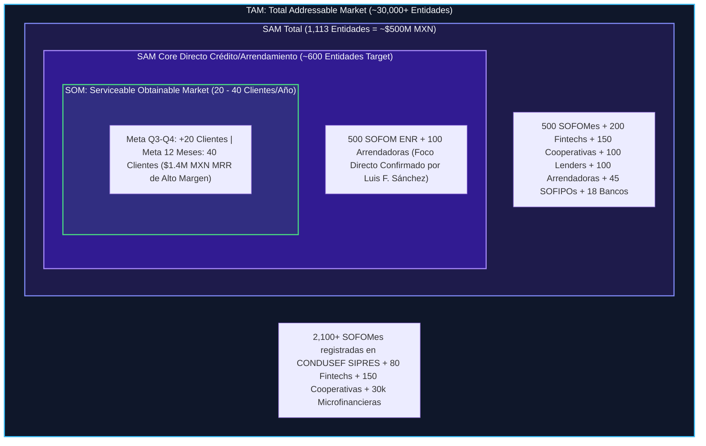

# 🏦 Caso de Negocio y Plan Estratégico de Crecimiento — Intelligential

**Preparado para:** Sesión Estratégica de Alineación con Luis Fernando Sánchez (CEO & Co-founder)  
**Líder de Proyecto / Full-Cycle AE & RevOps:** Antonio Gutiérrez  
**Objetivo Q3-Q4:** +20 Clientes Nuevos (+ $200,000 MXN MRR Adicional)  
**Meta SOM (12 Meses):** 40 Clientes Nuevos (Ritmo Anualizado)  
**Mercado Objetivo Calificado (SAM Total):** 1,113 Entidades en México (~ $500,000,000 MXN en Valor de Mercado)  
**SAM Core Directo (Crédito, Arrendamiento & Factoraje):** 600 Entidades de Alto ACV  

> [!IMPORTANT]
> **Marco Metodológico de Prudencia RevOps (Hipótesis & Auditoría Inicial):**  
> Toda propuesta de optimización de pricing, modelado de saturación de pipeline y sugerencias de expansión se presentan estrictamente como **hipótesis estratégicas y sugerencias a revisar a mediano plazo** durante la sesión de descubrimiento del Lunes.
> 
> Reconociendo la **adquisición de Intelligential por parte del fondo de inversión 5X Capital en Diciembre de 2024**, la ejecución táctica definitiva dependerá de auditar en vivo con Luis (quien conoce la industria a fondo):
> 1. **Salud de Caja & Mandato del Fondo:** Runway actual, metas de rentabilidad EBITDA vs. agresividad de gasto en adquisición (CAC).
> 2. **Historial Real de Tracción (Últimos 12-18 Meses):** Ritmo histórico de cierre, tasa de churn y Net Retention Rate (NRR) real.
> 3. **Mezcla de Canales de Adquisición:** Desglose del pipeline actual generado por eventos presenciales (ASOFOM/AMSOFAC), campañas de marketing inbound, referencias del portafolio de 5X Capital o prospección outbound en frío.

---

## 1. 📌 Resumen Ejecutivo y Tesis de Inversión

**Intelligential** es la única plataforma de infraestructura core bancaria y BaaS *Smart Native®* mexicana que integra nativamente **Core Bancario + Cumplimiento Normativo (CNBV/PLD) + Onboarding Digital (INE, SAT, IMSS)** en un solo sistema sobre AWS, activable en semanas y a un precio accesible para instituciones no bancarias.

### 💎 El Mensaje Maestro de Posicionamiento: Orquestación de Core & Compliance Embebido

Así como en la industria de pagos las empresas migraron de contratar pasarelas sueltas a adoptar **Orquestadores de Pagos** (Payment Orchestration), en la infraestructura crediticia las SOFOMes ya no buscan APIs aisladas:

```
+---------------------------------------------------------------------------------------------------+
|               EL CAMBIO DE PARADIGMA DE MERCADO: DE API SUELTA A ORQUESTACIÓN EMBEBIDA            |
+------------------------------------+--------------------------------------------------------------+
| ❌ EL PARADIGMA ANTIGUO (API SUELTA) | 🟢 EL PARADIGMA MODERNO (ORQUESTACIÓN EMBEBIDA)              |
| - Comprar API suelta de INE/RENAPO | - Intelligential Orquesta la Biometría + SAT + SPEI + PLD     |
| - Programar código in-house 6 meses| - Conectado nativamente al Motor de Cartera en AWS            |
| - Lidiar con descalce contable     | - 1 sola plataforma 3-en-1 activable en 30 días               |
+------------------------------------+--------------------------------------------------------------+
```

* **El Elevator Pitch Comercial:**  
  *"Intelligential no vende una API registral suelta. **Somos el Orquestador de Core Bancario y Cumplimiento Embebido sobre AWS**: conectamos la biometría, el SAT, el Buró y los rieles de pago directamente a la administración de tu cartera en 1 sola plataforma."*

### 🎯 Alineación Directa con el CEO (Luis F. Sánchez): Foco Estratégico de ICP a 3 Años

Basado en la alineación directa con el CEO, se establece la frontera clara del mercado objetivo y la filosofía de orquestación de la empresa:

```
+---------------------------------------------------------------------------------------------------+
|                        FOCO ESTRATÉGICO DE ICP A 3 AÑOS (CONFIRMADO POR LUIS F. SÁNCHEZ)          |
+------------------------------------+--------------------------------------------------------------+
| 🎯 SECTORES CORE DE NEGOCIO (ALTO MARGEN) | 🚫 SECTORES DESCARTADOS (EXHAUSTIVOS EN RECURSOS)        |
| - CRÉDITO SIMPLE & REVOLVENTE      | - Pagos masivos por WhatsApp (ej. Soy Aida)                  |
| - ARRENDAMIENTO PURO Y FINANCIERO  | - Agregadores de alta transaccionalidad / Pasarelas B2C       |
| - FACTORAJE DE CARTERA             | - Wallets transaccionales masivos (excepto casos contados)   |
| (Baja transaccionalidad: 1 pago/mes| (Consumen excesivos recursos AWS de cómputo sin MRR de alto ACV)|
+------------------------------------+--------------------------------------------------------------+
```

---

## 2. ⚔️ Matriz Ampliada de Competencia & Conclusión Única (Teardown Competitivo)

### 🎯 La Conclusión Clave: DynamiCore es el ÚNICO Rival Directo en el SAM

Tras auditar a todos los actores locales e internacionales, **DynamiCore es la ÚNICA competencia real directa en el mercado objetivo de 600 SOFOMes calificadas de México**. Los demás actores no compiten directamente en el mismo segmento:

* **Mambu:** Inalcanzable en precio ($80k+ USD/año) y sin PLD/CNBV nativo de México. *(Fuera de segmento)*.
* **Ascendes:** Software on-premise/legado obsoleto en servidores locales a punto de churnear. *(Target de migración)*.
* **Softcrédito / Moffin / Expediente Azul:** Herramientas modulares básicas sin Core bancario completo ni motor regulatorio CNBV. *(Módulos parciales)*.
* **Fintechland:** Boutique de desarrollo a la medida por proyecto (4-6 meses) a $300k+ setup. *(No es SaaS empaquetado)*.
* **Adamo / Truora:** RegTechs extranjeras de identidad sin contabilidad ni compliance SOFOM para México. *(Proveedores de data)*.

### 🤝 Matriz Estratégica de Coopetencia: Colaboración vs. Choque Frontal & Prevención de Fuga de Leads

| Aliado / Partner | Dónde Colaboramos (Integración Nativa) | Dónde Chocamos Frontalmente | Por Qué NO Le Resuelven a la SOFOM (El Argumento de Cierre) |
| :--- | :--- | :--- | :--- |
| **Nubarium** (`nubarium.com`) | Biometría facial (1-1, 1-N), OCR de INE/pasaportes y consulta RENAPO. | Venden la API suelta e intentan abarcar OCR + NOM-151 + PEPs. | **NO ES UN CORE BANCARIO.** Nubarium no administra la cartera de crédito, no calcula TIIE, no hace devengamiento contable ni lleva la contabilidad CNBV. Si compran solo Nubarium, la SOFOM tiene que contratar programadores por 6 meses para armar su software. **Intelligential ya trae a Nubarium pre-conectado por dentro.** |
| **Moffin / Nufi** | Conexión API a Buró / Círculo de Crédito y scoring crediticio. | Intentan vender formularios de KYC y listas negras por su cuenta. | **NO TIENEN MOTOR DE CARTERA.** Son herramientas de consulta aisladas; no generan tablas de amortización ni gestionan la cobranza. |
| **Syntage** | Infraestructura fiscal SAT, CIEC y facturación electrónica. | Ninguno *(Partner Puro de Data Fiscal)*. | **Punto de Alianza Directa.** Intelligential conecta Syntage para automatizar el expediente fiscal en 1 clic. |
| **Mifiel / Weetrust** | Firma electrónica NOM-151 y pagarés digitales ejecutivos. | Ninguno *(Partner Puro de Firma)*. | **Punto de Alianza Directa.** Intelligential orquesta la firma de Mifiel de origen en el flujo de solicitud digital. |
| **STP (Banxico)** | Riel bancario SPEI y asignación de CLABEs personalizadas. | Ninguno *(Partner Puro de Pagos)*. | **Punto de Alianza Directa.** Dispersión y cobranza automática integrada nativamente al Core. |

### ⚠️ Teardown Técnico: Validadores de PDF Superficiales vs. Orquestación Directa a Fuentes Oficiales

```
+---------------------------------------------------------------------------------------------------+
|               DIFERENCIA ENTRE FAKE VALIDATION (OCR PDF) VS. ORQUESTACIÓN REAL FUENTES OFICIALES  |
+------------------------------------+--------------------------------------------------------------+
| ❌ FAKE VALIDATION (OCR SUBIR PDF)  | 🟢 ORQUESTACIÓN INTELLIGENTIAL (FUENTES OFICIALES EN TIEMPO REAL)|
| - El usuario sube un PDF a una web | - Consulta directa al SAT vía CIEC / Syntage (Padrón 69-B)    |
| - La IA lee el texto del PDF (OCR) | - Verificación biométrica facial INE vs Lista Nominal CNBV   |
| - Vulnerable a PDFs alterados en IA| - Consulta instantánea a Buró de Crédito en tiempo real       |
| - RECHAZADO EN AUDITORÍA CNBV/PLD  | - Expediente electrónico con sello de tiempo NOM-151 (Mifiel) |
+------------------------------------+--------------------------------------------------------------+
```

---

## 3. 🔬 Ajuste Metodológico de Nicho: B2B Enterprise (Intelligential) vs. B2B Masivo (Clip)

Aplicando las lecciones auditadas en Clip ($10MDP/mes en ingresos adicionales):
* **El Error de la Prospección Masiva:** Las campañas online abiertas traen "leads basura" sin RFC ni cartera de crédito.
* **La Táctica Intelligential ("Sniper Outbound"):** Prospección quirúrgica 1-a-1 en los 600 decisores (CEOs/CFOs) de las SOFOMes y Arrendadoras identificadas en el padrón de CONDUSEF.

---

## 4. 💼 Muestra de Deals Calificados (Tiers 1, 2 y 3)

| Tier | Tipo de Entidad | Renta Mensual Sugerida | Setup Fee Decompresivo | Cartera Estimada |
| :--- | :--- | :--- | :--- | :--- |
| **Tier 1 (Startup/Naciente)** | SOFOM ENR / Fintech Semilla | $12,500 - $18,000 MXN | $40,000 MXN (Amortizable) | < $20M MXN |
| **Tier 2 (Growth)** | SOFOM ENR / Arrendadora Media | $25,000 - $35,000 MXN | $50,000 - $65,000 MXN | $20M - $100M MXN |
| **Tier 3 (Enterprise)** | Arrendadora Grande / Lender Regulado | $50,000 - $85,000 MXN | $100,000 MXN | > $100M MXN |

---

## 5. 📈 Cruce TAM / SAM / SOM y Calibración Quirúrgica del Mercado ($500M MXN)

### 📊 Desglose del SAM Total en México (1,113 Entidades — $500,000,000 MXN Valor de Mercado):

Criterios de inclusión: Operación activa de crédito en México + Cartera activa mayor a $100M MXN.

| Segmento del Mercado | Número de Entidades | Nivel de Prioridad en Intelligential |
| :--- | :--- | :--- |
| **SOFOM ENR** | **500 Entidades** | **🎯 Máxima Prioridad (ICP Core)** |
| **Fintechs (ITF / Lenders)** | **200 Entidades** | **🎯 Alta Prioridad (Lending Engine)** |
| **Cooperativas (SOCAPs)** | **150 Entidades** | 🟡 Fase 2 de Expansión |
| **Lenders Digitales** | **100 Entidades** | **🎯 Alta Prioridad (Digital Onboarding)** |
| **Arrendadoras Financieras** | **100 Entidades** | **🎯 Máxima Prioridad (ICP Core)** |
| **SOFIPOs** | **45 Entidades** | 🟡 Fase 2 de Expansión |
| **Bancos de Nicho** | **18 Entidades** | ⚪ Enterprise Especial |
| **TOTAL UNIVERSO SAM** | **1,113 Entidades** | **💰 ~ $500,000,000 MXN Valor Total del Mercado** |



---

## 6. 📊 Benchmark del Setup Fee (2x Renta): Estándares de la Industria Core SaaS

* **El Problema del Setup Fee Plano 2x:** En tratos Enterprise ($83k - $200k renta/mes), un setup fee de $166k - $400k genera fricción extrema y congela la negociación.
* **Propuesta de Pricing Decompresivo:** Setup fee fijo por Tier ($40k Tier 1, $50k Tier 2, $65k-$100k Tier 3), con la opción de diferir a 12 meses en contratos anuales o condonar con pago anticipado.

---

## 7. 🤖 Recomendación de Tech Stack Comercial: Conversational AI & Call Intelligence (`Samu.ai`)

* Implementar **Samu.ai** ($150 - $250 USD/mes) para grabar, resumir y extraer objeciones comerciales automáticamente de las llamadas de ventas con los CEOs de las SOFOMes.

---

## 8. 🎙️ Cuestionario de Auditoría & Descubrimiento para la Sesión del Lunes con Luis

1. **Mezcla de Canales Actuales (Eventos vs Campañas vs Referencias 5X Capital).**
2. **Posicionamiento de Orquestación de Core & Compliance Embebido frente a APIs sueltas.**
3. **Validación Directa a Fuentes Oficiales (SAT/INE) vs. Herramientas de OCR de PDF superficiales.**
4. **Calibración Quirúrgica del SAM (1,113 Entidades Total = ~$500M MXN vs. 600 Core Target de Crédito/Arrendamiento).**
5. **Mandato del Fondo 5X Capital (Crecimiento MRR vs Margin EBITDA).**
6. **Manejo de Coopetencia & Alianza con Nubarium (Orquestación 3-en-1 vs API suelta).**
7. **Desplazamiento Directo de DynamiCore (La única competencia real en el SAM).**
8. **Benchmark & Flexibilidad de Setup Fee Decompresivo.**
9. **Adopción de Samu.ai para Inteligencia Conversacional en Demos ($150 USD/mes).**
10. **Visión de Expansión (Verticales SOFIPOs/SOCAPs y LatAm).**

---
*Documento estratégico preparado para la alineación comercial con Luis Fernando Sánchez.*
