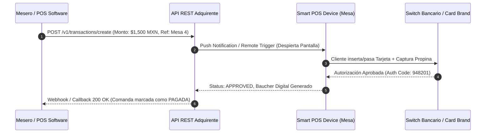

# 📄 Business Case & Fichas Técnicas de Proveedores: Adquirente FinTech x Software POS de Restaurantes

**Autor / Vehículo de Originación:** Firma BD & Channel Management (Antonio Gutiérrez & Socios)  
**Fecha:** Julio 2026  
**Estatus:** Modelo Genérico Portátil con Fichas de Documentación Oficial Investigadas

---

## Executive Summary

El presente Business Case establece la arquitectura de **alianza comercial, unit economics y modelo de integración tecnológica** entre una entidad **Adquirente / Agregadora FinTech** y una plataforma de **Software POS de Restaurantes** (sistema de comandas y administración).

La oportunidad consiste en capturar la cartera transaccional de restaurantes (especialmente en zonas turísticas y de alto ticket medio) sustituyendo terminales bancarias y agregadores desconectados por una solución **nativamente integrada comanda-a-terminal vía API**.

---

## 1. ⚔️ Tesis de Mercado y Ventaja Competitiva

1. **Movimiento Defensivo y Tendencia M&A:**
   * Agregadores líderes (ej. Clip comprando Wansoft) y software dominantes de la industria (ej. SoftRestaurant con terminales propias) están cerrando la distribución mediante ecosistemas cerrados (POS + Pagos).
   * Para cualquier **Adquirente o Agregador FinTech**, aliarse de forma nativa con softwares de restaurantes independientes es la única vía para **proteger y hacer crecer la cartera gastronómica sin incurrir en CAC (Costo de Adquisición de Clientes)**.

2. **Diferencial del Modelo Adquirente:**
   * Las terminales tradicionales cobran comisiones agregadas de **~2.9% a 3.6% + cuotas fijas**.
   * Un Adquirente directo puede ofrecer una **tasa adquirente altamente competitiva de 2.26% - 2.74% en nacional y 3.20% en internacional**, dejando un **Net Margin (Margen Neto) de ~1.10% (110 bps)** libre de costos de intercambio de red.

---

## 2. 📊 Unit Economics & Matriz de Tasas Reales de Adquisición

### Benchmark de Industria & Sesgo Turístico:
* **Tasa Crédito Nacional (Restaurante):** 2.74%
* **Tasa Débito Nacional (Restaurante):** 2.26%
* **Tasa Tarjeta Internacional:** 3.20%
* **Mezcla Transaccional Estimada (50% Nac / 50% Intl en zona turística):** **2.85% Tasa Ponderada**.
* **Costo Directo de Red / Intercambio (Visa, Mastercard, Bancos):** ~1.75%
* **Net Margin Adquirente:** **1.10% a 1.45% (110 a 145 bps del TPV Total)**.

---

## 3. 🌊 Waterfall del Reparto del Net Margin (Pool del Canal 35%)

De los **110 a 145 bps de Net Margin** limpios capturados por el Adquirente:

```
                      ┌──────────────────────────────────────────┐
                      │    Net Margin Adquirente (~127.5 bps)    │
                      └────────────────────┬─────────────────────┘
                                           │
         ┌─────────────────────────────────┼─────────────────────────────────┐
         ▼                                 ▼                                 ▼
┌──────────────────────────┐   ┌──────────────────────────┐   ┌──────────────────────────┐
│ Adquirente (65% Net)     │   │  Software POS (25% Net)  │   │  Nuestros 3 Socios (10%) │
│  Retención Libre de CAC  │   │   Incentivo Distribución │   │  Originación BD & Channel│
│    (82.8 bps del TPV)    │   │    (31.8 bps del TPV)    │   │    (12.75 bps del TPV)   │
└──────────────────────────┘   └──────────────────────────┘   └──────────────────────────┘
```

---

## 4. 📈 Escenarios de Escala y Proyección de Revenue Recurrente (MRR)

Calculado bajo un **TPV promedio conservador por nodo de $600,000 MXN / mes** (Restaurante Turístico Mediano) con 50% Tarjeta Internacional:

| Nodos Activos | TPV Cartera Mensual | Net Margin Adquirente (127.5 bps) | Software POS (25% Net) | **NUESTROS 3 SOCIOS (10% NET)** | Success Fee Único ($500/nodo) |
| :--- | :--- | :--- | :--- | :--- | :--- |
| **10 Nodos** | $6.0 MDP / mes | $76,500 MXN | $19,125 MXN / mes | **$7,650 MXN / mes** | $5,000 MXN |
| **25 Nodos** | $15.0 MDP / mes | $191,250 MXN | $47,813 MXN / mes | **$19,125 MXN / mes** | $12,500 MXN |
| **50 Nodos** | $30.0 MDP / mes | $382,500 MXN | $95,625 MXN / mes | **$38,250 MXN / mes** | $25,000 MXN |
| **100 Nodos** | $60.0 MDP / mes | $765,000 MXN | $191,250 MXN / mes | **$76,500 MXN / mes** | $50,000 MXN |
| **250 Nodos** | $150.0 MDP / mes | $1,912,500 MXN | $478,125 MXN / mes | **$191,250 MXN / mes** | $125,000 MXN |

---

## 5. 🔌 Arquitectura Técnica de Integración API (Super Sencilla)

El esquema tecnológico opera mediante una arquitectura cliente-servidor ultraligera donde el **Adquirente provee el Smart POS Device (Terminal Android)** y una **API REST de Cobro**:



---

## 6. 📚 FICHAS TÉCNICAS Y DOCUMENTACIÓN DE LOS 4 PROVEEDORES

Investigación de documentación técnica, APIs, modelos operacionales y contactos directos:

### 1. 🏦 **Efevoo Pay** (`efevoopay.com`)
* **Estatus Operativo:** Adquirente no bancario y procesador directo con conexión centralizada a **PROSA**.
* **Hardware & Terminales:** Terminal Smart Android (Modelos: Smart, Ultra, Pro, Mini, Core, One) con opción de **Marca Blanca** (branding personalizado del POS).
* **Documentación & API:** 
  * API REST modular con entrega de proyectos **"Llave en Mano"** (sin requerir certificaciones complejas del lado del software).
  * Soporte de Push to Device y Webhooks de confirmación inmediata.
* **Ciclo de Liquidación:** **T+1 (Siguiente día hábil)** antes de las 9:00 AM.
* **Seguridad:** Módulo nativo antifraude personalizable y PCI DSS.
* **Contacto Directo:** `hola@efevoopay.com` / `rodrigo@efevoopay.com` | San Pedro Garza García, N.L.

---

### 2. ⚡ **BZ PAY Solutions** (`bzpay.com.mx`)
* **Estatus Operativo:** FinTech mexicana fundada en 2018, regulada bajo supervisión de la **CNBV y Banco de México**.
* **Hardware & Terminales:** Modelos BZPOS, BZLITE, BZTOP (Smart POS Android y portátiles).
* **Documentación & API:**
  * Infraestructura API para conexión con Puntos de Venta (POS), E-commerce (**BZCOMMERCE**) y Links de Pago (**BZLINK**).
  * Aceptación de Visa, Mastercard, Carnet, Amex y Vales de Despensa + Meses Sin Intereses (3 a 12 meses).
* **Ciclo de Liquidación:** **En 24 Horas (Días Hábiles)** — *Diferencial clave para restaurantes*.
* **Esquema Comercial:** Sin rentas fijas ni mínimos de facturación; comisiones personalizadas por giro.
* **Contacto Directo:** `soporte@bzpay.com.mx` | Tel: 800 999 2972 / WA: (55) 4884 8558.

---

### 3. 🛠️ **Prosepago** (`prosepago.com`)
* **Estatus Operativo:** Operado por *Payment Services México S.A. de C.V.*, con adquirencia y respaldo bancario (principalmente BBVA).
* **Hardware & Terminales:** Terminales físicas PINPAD presenciales y Kioscos de autoservicio (Prosemático).
* **Documentación & API:**
  * Software/Driver **Prosepago Net** y APIs REST para integración bidireccional entre el sistema POS y las terminales PINPAD.
  * Integración probada y documentada con múltiples softwares comerciales de punto de venta en México (ej. Eleventa, etc.).
  * Elimina digitación manual del monto en terminal.
* **Contacto Directo:** `prosepago.com` | Tel: (662) 310 0814.

---

### 4. 🌐 **AxxiPay** (`axxipay.com`)
* **Estatus Operativo:** Pasarela y procesador omnicanal perteneciente al grupo multinacional **PMI Americas / PMI Tech**.
* **Hardware & Servicios:** Pasarela de pago E-commerce + Terminales físicas POS + SPEI + Pin AXXI.
* **Documentación & API:**
  * API REST moderna, SDKs y plugins para e-commerce/POS con motor de **Enrutamiento Inteligente** para maximizar la tasa de aprobación de cobros.
  * Seguridad avanzada: 3D-Secure 2.0, Tokenización de tarjetas y certificación PCI DSS.
* **Contacto Directo:** `pmi-americas.com` / `pmi.tech`.

---

## 7. 🛡️ Criterios Mínimos de Calificación para Firmar Convenio ISO

1. **Licencia / Capacidad de Adquirencia Directa:** Ofrecer tasas adquirentes competitivas (~2.45% nac / 3.20% intl).
2. **Capacidad de DCC (Dynamic Currency Conversion) / Multimoneda:** Para maximizar el margen neto en zonas turísticas.
3. **API REST / SDK de Cobro para POS:** Push to device y Webhook callback para cierre automático de mesa.
4. **Respeto a la Estructura de Canal ISO:** 10% - 15% del Net Margin para originadores + Success Fee de activación.

---

### 🌐 Herramienta Interactiva
El simulador interactivo completo con dibujitos y calculadora de ROI está disponible en:  
🔗 [revshare_dashboard.html](file:///C:/Users/Antonio/.gemini/antigravity-ide/scratch/intelligential/revshare_dashboard.html)
