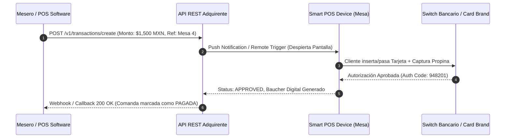

# 📄 Business Case & Modelo de Alianza Financiera: Adquirente / Agregador FinTech x Software POS de Restaurantes

**Autor / Vehículo de Originación:** Firma BD & Channel Management (Antonio Gutiérrez & Socios)  
**Fecha:** Julio 2026  
**Estatus:** Modelo Genérico Portátil (Agnóstico a Procesador / Adquirente)

---

## Executive Summary

El presente Business Case establece la arquitectura de **alianza comercial, unit economics y modelo de integración tecnológica** entre una entidad **Adquirente / Agregadora FinTech** y una plataforma de **Software POS de Restaurantes** (sistema de comandas y administración).

La oportunidad consiste en capturar la cartera transaccional de restaurantes (especialmente en zonas turísticas y de alto ticket medio) sustituyendo terminales bancarias y agregadores desconectados por una solución **nativamente integrada comanda-a-terminal vía API**.

---

## 1. ⚔️ Tesis de Mercado y Ventaja Competitiva

1. **Movimiento Defensivo y Tendencia M&A:**
   * Agregadores líderes (ej. Clip comprando Wansoft) y software dominantes de la industria (ej. SoftRestaurant con terminales propias) están cerrando la distribución mediante ecosistemas cerrados (POS + Pagos).
   * Para cualquier **Adquirente o Agregador FinTech**, aliarse de forma nativa con softwares de restaurantes independientes es la única vía para **proteger y hacer crecer la cartera gastronómica sin incurrir en CAC (Costo de Adquisición de Clientes)**.

2. **Diferencial del Modelo Adquirente:**
   * Las terminales tradicionales cobran comisiones agregadas de **~2.9% a 3.6% + cuotas fijas**.
   * Un Adquirente directo puede ofrecer una **tasa adquirente altamente competitiva de 2.26% - 2.74% en nacional y 3.20% en internacional**, dejando un **Net Margin (Margen Neto) de ~1.10% (110 bps)** libre de costos de intercambio de red.

---

## 2. 📊 Unit Economics & Matriz de Tasas Reales de Adquisición

### Benchmark de Industria & Sesgo Turístico:
* **Tasa Crédito Nacional (Restaurante):** 2.74%
* **Tasa Débito Nacional (Restaurante):** 2.26%
* **Tasa Tarjeta Internacional:** 3.20%
* **Mezcla Transaccional Estimada (50% Nac / 50% Intl en zona turística):** **2.85% Tasa Ponderada**.
* **Costo Directo de Red / Intercambio (Visa, Mastercard, Bancos):** ~1.75%
* **Net Margin Adquirente:** **1.10% (110 bps del TPV Total)**.

---

## 3. 🌊 Waterfall del Reparto del Net Margin (Pool del Canal 32.5%)

De los **110 bps de Net Margin** limpios capturados por el Adquirente:

```
                      ┌──────────────────────────────────────────┐
                      │    Net Margin Adquirente (~110 bps)      │
                      └────────────────────┬─────────────────────┘
                                           │
         ┌─────────────────────────────────┼─────────────────────────────────┐
         ▼                                 ▼                                 ▼
┌──────────────────────────┐   ┌──────────────────────────┐   ┌──────────────────────────┐
│ Adquirente (67.5% Net)   │   │  Software POS (25% Net)  │   │  Nuestros 3 Socios (7.5%)│
│  Retención Libre de CAC  │   │   Incentivo Distribución │   │  Originación BD & Channel│
│   (74.25 bps del TPV)    │   │    (27.5 bps del TPV)    │   │    (8.25 bps del TPV)    │
└──────────────────────────┘   └──────────────────────────┘   └──────────────────────────┘
```

---

## 4. 📈 Escenarios de Escala y Proyección de Revenue Recurrente (MRR)

Calculado bajo un **TPV promedio conservador por nodo de $600,000 MXN / mes** (Restaurante Turístico Mediano):

| Nodos Activos | TPV Cartera Mensual | Net Margin Adquirente (110 bps) | Software POS (25% Net) | **NUESTROS 3 SOCIOS (7.5% NET)** | Success Fee Único ($500/nodo) |
| :--- | :--- | :--- | :--- | :--- | :--- |
| **10 Nodos** | $6.0 MDP / mes | $66,000 MXN | $16,500 MXN / mes | **$4,950 MXN / mes** | $5,000 MXN |
| **25 Nodos** | $15.0 MDP / mes | $165,000 MXN | $41,250 MXN / mes | **$12,375 MXN / mes** | $12,500 MXN |
| **50 Nodos** | $30.0 MDP / mes | $330,000 MXN | $82,500 MXN / mes | **$24,750 MXN / mes** | $25,000 MXN |
| **100 Nodos** | $60.0 MDP / mes | $660,000 MXN | $165,000 MXN / mes | **$49,500 MXN / mes** | $50,000 MXN |
| **250 Nodos** | $150.0 MDP / mes | $1,650,000 MXN | $412,500 MXN / mes | **$123,750 MXN / mes** | $125,000 MXN |

---

## 5. 🔌 Arquitectura Técnica de Integración API (Super Sencilla)

El esquema tecnológico opera mediante una arquitectura cliente-servidor ultraligera donde el **Adquirente provee el Smart POS Device (Terminal Android)** y una **API REST de Cobro**:



### Explicación en 4 Pasos:
1. **Llamada de Cobro:** Cuando el mesero cierra la comanda en el Software POS, el sistema realiza un `POST /v1/transactions/create` indicando monto, terminal_id y referencia de mesa.
2. **Push to Device:** La API del Adquirente envía una notificación push instantánea a la terminal física **Smart POS** ubicada en la mesa del cliente.
3. **Procesamiento de Tarjeta:** La terminal se enciende con el monto exacto. El cliente paga (inserta/desliza/contactless) y selecciona propina. La terminal consulta al Switch bancario.
4. **Callback & Cierre Automático:** La terminal aprueba la transacción y la API notifica al Software POS mediante un Webhook instantáneo. La comanda se cierra automáticamente sin digitación manual humana.

---

## 6. 🛡️ Portabilidad & Estrategia Multi-Adquirente

Este Business Case está diseñado de forma **agnóstica y portátil**. En caso de que un Adquirente específico intente restringir los porcentajes o retrasar los acuerdos de integración, el vehículo de originación mantiene el control de la relación comercial para presentar y desplegar la misma solución con:

* **Fiserv / First Data**
* **Getnet (Grupo Santander)**
* **EVO Payments / Banorte**
* **Mercado Pago Enterprise**
* **Kushki / Nu / Velo**

---

### 🌐 Herramienta Interactiva
El simulador interactivo completo y la calculadora de ROI están disponibles en:  
🔗 [revshare_dashboard.html](file:///C:/Users/Antonio/.gemini/antigravity-ide/scratch/intelligential/revshare_dashboard.html)
